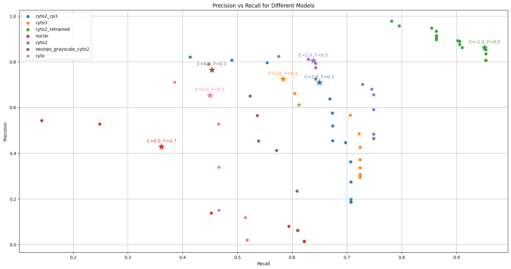

# SLAP2-Cellpose
## Cellpose Nuclei model retrained with SLAP2 data 

This repository contains a version of the Cellpose nuclei model that has been retrained using SLAP2 data. The Cellpose model is a generalist algorithm for cell segmentation.

# 1a. Create an conda env
`conda create -n cellpose python=3.12`

`conda activate cellpose`

# 1b. For SLAP2 rig only:

1. Create an environment:
    ```
    /path/to/python3 -m venv cellpose
    ```

2. Activate the environment:
    ```
    cd to C:\Users\ScanImage\Documents\GitHub\SLAP2-Cellpose
    cellpose\Scripts\activate
    ```

## [Warning] Run either 1a or 1b based on your setup. 

# 2. Install cellpose
`pip install -U --no-cache-dir git+https://www.github.com/mouseland/cellpose.git`

# 3. Running cellpose 
`python run.py --input <input_file_path> --output <output_directory_path>`
## Example
`python run.py --input /Users/caleb.shibu/Downloads/725018_20240326_163614_DMD1_merged.tif --output /Users/caleb.shibu/Desktop/test-cellpose` 

The output folder would have 2 files `flows.tif` and `masks_pred.tif`.

# Model comparison before and after retraining:


Cyto2 model gave the highest AUC value for CellProbabilty of 2 and FlowThreshold of 0.5. We used that to train cyto2 model with Voltage Imaging data and the AUC value improved for CellProbabilty of -1.0 and FlowThreshold of 0.5. 
